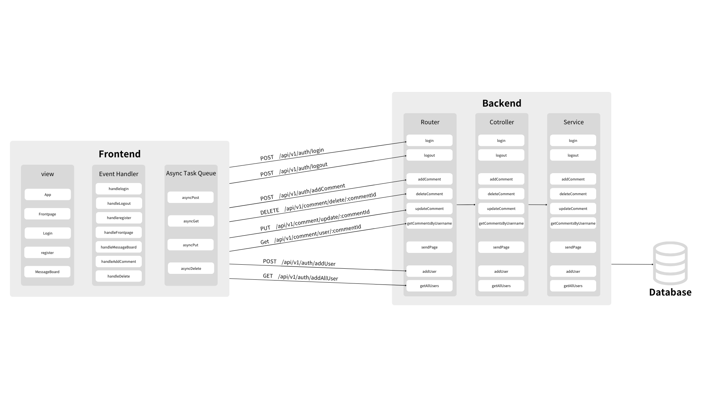

## 專案主題與目標

**專案主題**：
- 留言板

**專案目標**：
- 建立一個基於前後端分離架構的留言管理系統。
- 提供基本的留言 CRUD 功能（新增、查詢、更新、刪除）。

---

## 技術選擇原因
- **前端**：React.js
  - 易於構建動態的使用者界面。
  - 具備強大的社群支持與豐富的 UI 庫。

- **後端**：Node.js + Express
  - 單執行緒模型適合 I/O 密集型應用。
  - 擁有豐富的中間件支持，簡化 API 開發。

- **資料庫**：MongoDB
  - 非結構化數據的靈活存儲，特別適合留言數據模型。
  - 提供高效的查詢能力與水平擴展支持。

---

## 架構說明
- **前端**：用戶通過 React 應用操作留言界面。
- **後端**：Express 負責處理 API 請求並與資料庫交互。
- **資料庫**：MongoDB 用於存儲用戶留言及其相關數據。

---

## 安裝與執行指引

### 前置條件
1. 安裝 [Node.js](https://nodejs.org/) 與 npm。
2. 安裝 [MongoDB](https://www.mongodb.com/) 並啟動服務。

### 安裝步驟

1. Clone 專案
```bash
git clone <repository_url>
cd <project_directory>
```
2. 安裝依賴
```bash
npm install
```
3. 配置環境變數
```bash
cp .env.example .env
#修改 .env 文件，配置 MongoDB URI
```

4. 啟動後端服務
```bash
npm run dev
```

---

## API 規格說明文件

| 路由                                | HTTP 方法 | 描述              |
|------------------------------------|-----------|-------------------|
| `/api/v1/auth/login`               | POST      | 用戶登入           |
| `/api/v1/auth/logout`              | POST      | 用戶登出           |
| `/api/v1/user/addUser`             | POST      | 新增用戶           |
| `/api/v1/user/getAllUsers`         | GET       | 取得所有用戶       |
| `/api/v1/comment/addComment`       | POST      | 新增留言           |
| `/api/v1/comment/update/:commentId`| PUT       | 更新留言           |
| `/api/v1/comment/delete/:commentId`| DELETE    | 刪除留言           |
| `/api/v1/comment/user/:username`   | GET       | 取得用戶的所有留言  |

---

### API 詳細規格

#### 1. 用戶登入
- **路由**: `/api/v1/auth/login`
- **方法**: POST
- **請求參數**:
  ```json
   {
   "username": "testUser",
   "password": "password123"
   }
  ```
- **回應格式**:
  ```json
   {
   "code": 200,
   "message": "Login successful.",
   "body": ""
   }
  ```

#### 2. 用戶登出
- **路由**: `/api/v1/auth/logout`
- **方法**: POST
- **回應格式**:
  ```json
   {
   "code": 200,
   "message": "Logout succeeded",
   "body": ""
   }
  ```

#### 3. 新增用戶
- **路由**: `/api/v1/user/addUser`
- **方法**: POST
- **請求參數**:
  ```json
   {
   "username": "newUser",
   "password": "securePassword"
   }
  ```
- **回應格式**:
  ```json
   {
   "code": 200,
   "message": "User added successfully"
   }
  ```

#### 4. 取得所有用戶
- **路由**: `/api/v1/user/getAllUsers`
- **方法**: GET
- **回應格式**:
  ```json
  {
    "code": 200,
    "message": "Users retrieved successfully",
    "body": [
        {
            "_id": "678119bce34268b21e2f0712",
            "username": "user123",
            "password": "hashed_password_123"
        },
        {
            "_id": "678119bce34268b21e2f0713",
            "username": "user456",
            "password": "hashed_password_456"
        },
        {
            "_id": "678242748ad9d90eae4112d8",
            "username": "test",
            "password": "test"
        },
        {
            "_id": "67851144b430a5892012c8e3",
            "username": "FUKUMA",
            "password": "123456"
        },
        {
            "_id": "6785167ab430a5892012c8e8",
            "username": "newUser",
            "password": "securePassword"
        }
    ]
}
  ```

#### 5. 新增留言
- **路由**: `/api/v1/comment/addComment`
- **方法**: POST
- **請求參數:**:
   ```json
   {
   "username": "FUKUMA",
   "text": "This is a test comment."
   }
   ```
- **回應格式**:
   ```json
   {
    "code": 201,
    "message": "Comment added",
    "body": {
        "text": "This is a test comment.",
        "username": "FUKUMA",
        "_id": "67851795b430a5892012c8eb",
        "timestamp": "2025-01-13T13:39:33.310Z",
        "__v": 0
    }
   }
   ```
#### 6. 更新留言
- **路由**: `/api/v1/comment/update/:commentId`
- **方法**: PUT
- **請求參數:**
   ```json
   {
   "message": "Updated comment content."
   }
   ```
- **回應格式**:
   ```json
  {
    "code": 200,
    "message": "Comment updated",
    "body": {
        "_id": "67851795b430a5892012c8eb",
        "text": "Updated comment content.",
        "username": "FUKUMA",
        "timestamp": "2025-01-13T13:39:33.310Z",
        "__v": 0
    }
  }
   ```

#### 7. 刪除留言
- **路由**: `/api/v1/comment/delete/:commentId`
- **方法**: DELETE
- **回應格式:**:
   ```json
  {
    "code": 200,
    "message": "Comment deleted",
    "body": null
  }
   ```

#### 8. 取得用戶的所有留言
- **路由**: `/api/v1/comment/user/:username`
- **方法**: GET
- **請求參數:**:
   ```json
   {
    "code": 200,
    "message": "Comments retrieved",
    "body": [
        {
            "_id": "6784fc27184281f90ded4da3",
            "text": "測試留言",
            "username": "anonymous",
            "timestamp": "2025-01-13T11:42:31.689Z",
            "__v": 0
        }
    ]
  }

   ```
---

## 架構圖與流程圖


---

## 分工表
   - 前端CSS：鍾珺如、周朕聿
   - 後端、前端：姚郁君、郭玉琦
   - 文件與繪圖：羅畹宜
